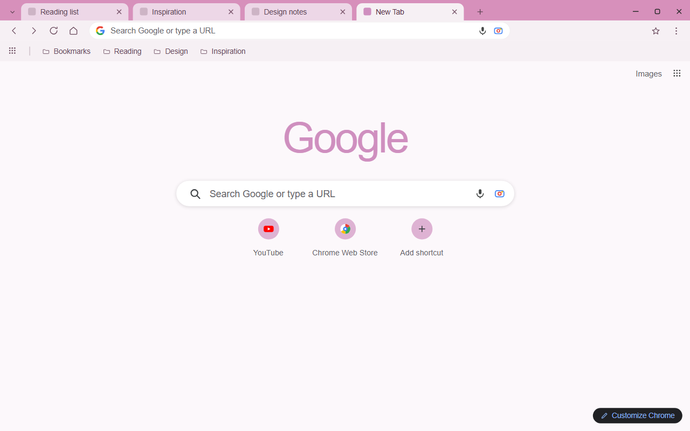
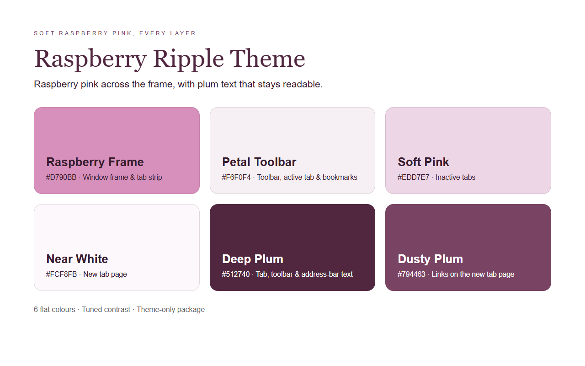

<p align="center">
  
</p>

<h1 align="center">Raspberry Ripple Theme</h1>

<p align="center">A light Chrome theme built around raspberry pink, soft plum text, and a pale new tab page.</p>

<p align="center">
  
  
</p>

## About

Raspberry Ripple paints the browser in one continuous pink family: a raspberry frame and tab strip on top, a petal-pink toolbar and active tab below it, and a pale new tab page where the page itself stays quiet. Plum text carries through the tab labels, bookmarks, and address bar so every layer stays readable.

Each surface is a flat, single solid color, so the interface keeps its calm while you work. The whole palette lives in `manifest.json`; installing the theme simply recolors the browser, and the theme mark follows the same three-tone ripple from the frame color down to deep plum.

## Color Palette

| Token | Hex | Usage |
|-------|-----|-------|
| Raspberry Frame | `#D790BB` | Window frame, tab strip, window buttons |
| Petal Toolbar | `#F6F0F4` | Toolbar, active tab, bookmark bar |
| Soft Pink | `#EDD7E7` | Inactive tabs |
| Near White | `#FCF8FB` | New tab page background |
| Deep Plum | `#512740` | Tab, toolbar, and address-bar text & icons |
| Dusty Plum | `#794463` | Links on the new tab page |

## Chrome UI Notes

A few parts of the browser are painted by Chrome itself rather than by the theme manifest. The store artwork follows what Chrome renders after installing this theme, with these two colors pixel-sampled from a real install:

- **Google mark on the new tab page:** with `ntp_logo_alternate` enabled Chrome draws it as a single flat color derived from the new tab background, keeping that background's hue and saturation and clamping the lightness. It renders as soft raspberry `#CF8FBF`.
- **Shortcut tiles:** Chrome tints the round new-tab shortcut buttons from the same background, rendering them as pale pink `#DEB2D3`.
- **Window buttons:** Chrome keeps the minimize, maximize, and close glyphs dark against the raspberry frame.
- **Address bar:** the omnibox keeps the white background declared by the theme, which separates it from the petal-pink toolbar.

## Features

- Raspberry pink, petal pink, and near-white in one continuous palette.
- One flat solid color per surface, from the window frame down to the new tab page.
- Tab, toolbar, bookmark, and address-bar text tuned for contrast at every level.
- Calm new tab page with a Chrome-generated single-color wordmark.
- Theme-only package: Chrome applies it straight from the manifest's `theme` block.

## Install

### Load unpacked (local)

1. Download or clone this repository.
2. Open `chrome://extensions` in Chrome.
3. Turn on **Developer mode** in the top-right corner.
4. Click **Load unpacked** and select this folder.

### Chrome Web Store

Package the folder as a `.zip` (or use `chrome://extensions` → **Pack extension**) and upload it through the Chrome Web Store Developer Dashboard. The listing uses the assets under `store-assets/`.

## Preview





## Files

| File | Description |
|------|-------------|
| `manifest.json` | Chrome theme manifest (MV3) with the inline `theme` config |
| `logo/logo.png` | Theme icon, 128x128 |
| `store-assets/screenshots/en/` | Store listing screenshots (1280x800) |
| `store-assets/promo/` | Promo tiles (440x280 and 1400x560) |
| `store-assets/references/` | The HTML/CSS source of every store image |
| `scripts/generate-logo.py` | Draws the icon into `logo/logo.png` |
| `scripts/generate-references.py` | Renders all four store images with headless Chromium |

Regenerate the icon and the store images:

```
python3 scripts/generate-logo.py final waves light
python3 scripts/generate-references.py
```

## Packaging

`python3 scripts/pack_store.py` builds the upload-ready Chrome Web Store zip into
`dist/raspberry-ripple-theme-<version>.zip` and mirrors the same file to the
default project folder (`D:\迅雷下载\vibe coding\`). The script self-verifies that
`manifest.json` sits at the zip root and that the mirror matches byte for byte.

The zip holds only the theme body — `manifest.json`, `logo/logo.png`, and this
`README.md`. Store screenshots, promo tiles, the `scripts/` generators, and local
files (`.codebuddy/`, `.gitignore`) stay out of the package, since the Web Store
uploads those assets separately on the listing form.

## License

Non-Commercial License — personal use is permitted, commercial use requires permission.
